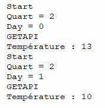
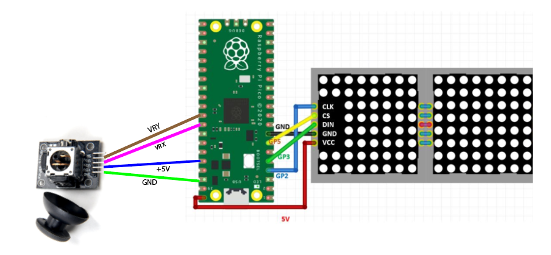

# Météo_IOT
Projet réalisé par Tony ZHANG et Romain PARISOT.\
Ce projet a été réalisé en 15 heures lors du cours Data & IOT du lundi 30 janvier au vendredi 3 février.\
Le projet consiste à créer un appareil connecté à une API.\
Nous avons donc eu l'idée de faire un script qui affiche la météo sur un panneau LED.

<h2>Preview</h2>

## Fonctionnement du projet
Ce projet a été réalisé en Python et récupère des données de l'API : "API Météo".\
Avec cette API, nous récupérons la température de la localisation de notre école à Nanterre, puis elle est organisée sous la forme de quarts :

- Premier quart : 1 h - 7 h
- Deuxième quart : 7 h - 13 h
- Troisième quart : 13 h - 19 h
- Quatrième quart : 19 h - 1 h 

Ensuite, nous spécifions le jour (jusqu'à 14 jours).

Le joystick permet de naviguer entre les quarts avec l'axe X et de naviguer entre les jours sur l'axe Y. 

Enfin, en fonction de la date et du quart que nous souhaitons afficher, nous récupérons les données lors de la requête pour afficher la température.

## Voici une démonstration du projet :

https://youtube.com/shorts/-cIcWP7xgao?feature=share

Reproduction de notre projet
Si vous souhaitez réaliser ce projet, vous devrez modifier les informations de connexion Wifi dans le code en renseignant votre nom Wifi et le mot de passe.\
Ensuite, vous devrez vous créer un compte sur API Météo pour récupérer votre token.\
Vous pouvez essayer de garder le même token, mais étant donné que nous avons une version gratuite, mon token est limité à 500 requêtes par jour.\
Dans l'URL, vous pouvez modifier la localisation de la ville que vous souhaitez récupérer.\
Enfin, vous devrez reproduire les branchements du schéma ci-dessous et posséder les équipements suivants :

- 2 panneaux LED Mac 7219
- 1 Raspberry Pi W
- 1 Joystick
- 14 fils

